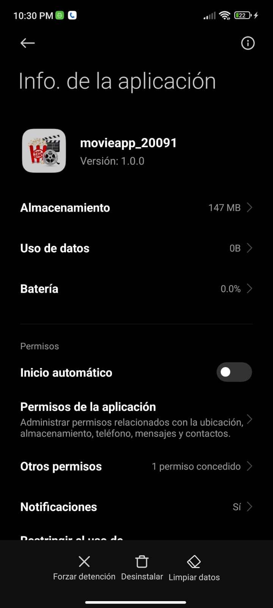
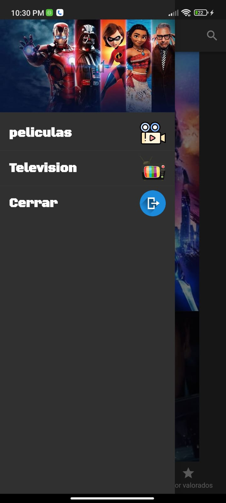
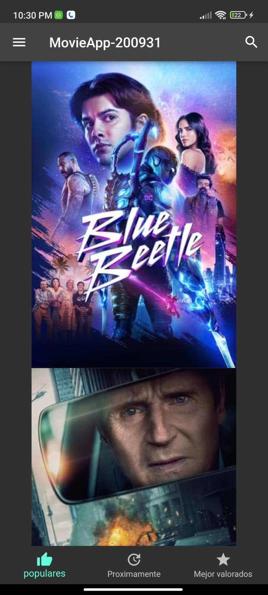

# MovieApp-200931

## Información General

- **Creado por:** Uriel Maldonado Cortez
- **Asignatura:** Desarrollo Movil Integral
- **Grado:** 10
- **Grupo:** A
- **Docente:** MTI. Marco Antonio Ramirez Hernandez

## Descripción del Proyecto

Este proyecto representa una aplicación de muestra desarrollada en Flutter que muestra una página de inicio de la aplicación "MovieApp-200931". La página de inicio contiene los siguientes componentes principales:

### `Home.dart`

Este archivo contiene la clase `Home`, que representa la página de inicio de la aplicación. En el método `initState`, se llama a `_loadJson` para cargar datos de películas utilizando `HttpHandler`. También se define un estilo de fuente personalizado y se crea la estructura principal de la aplicación, que incluye una AppBar, un Drawer y un BottomNavigationBar.

### 1. AppBar (Barra de Navegación Superior)

La AppBar muestra el título "MovieApp-200931" en el centro y un icono de búsqueda en la esquina derecha. Aquí se puede realizar la navegación y realizar búsquedas.

### 2. Menú Lateral (Drawer)

El menú lateral se abre deslizando desde el borde izquierdo de la pantalla o tocando el icono de menú en la AppBar. Contiene las siguientes opciones:

- **"peliculas"**: Una opción que muestra películas y utiliza un estilo de fuente personalizado para dar formato al texto.

- **"Television"**: Una opción que muestra programas de televisión y utiliza el mismo estilo de fuente personalizado.

- **"Cerrar"**: Una opción que permite cerrar el menú lateral y volver a la página de inicio.

### 3. Barra de Navegación Inferior (BottomNavigationBar)

La barra de navegación inferior contiene tres elementos:

- **"populares"**: Muestra películas populares y tiene un ícono de pulgar hacia arriba.

- **"Proximamente"**: Muestra películas próximas a estrenarse y tiene un ícono de actualización.

- **"Mejor valorados"**: Muestra películas mejor valoradas y tiene un ícono de estrella.

### `media_list.dart`

Este archivo contiene la definición de la clase `MediaList`, que es un StatefulWidget que representa una lista de medios. Actualmente, en el método `build`, devuelve un contenedor vacío. Puedes personalizar esta parte para mostrar la lista de medios.

### `HttpHandler.dart`

El archivo `HttpHandler.dart` contiene la lógica para realizar solicitudes HTTP y obtener datos de películas desde una API. Define la clase `HttpHandler`, que tiene métodos para obtener datos JSON y `fetchMovies`.

### `Constants.dart`

El archivo `Constants.dart` define una constante `API_KEY`, que se utiliza en `HttpHandler.dart` para autenticar las solicitudes a la API.

La aplicacion muestra en el cuerpo principal los poster e las peliculas mas populares
## Uso de Fuente Personalizada

La aplicación utiliza un estilo de fuente personalizado (`customTextStyle`) que se define en el código. Esta fuente personalizada se especifica en el archivo `pubspec.yaml` y se aplica a los elementos de texto en la aplicación para darle un aspecto distintivo.

## Capturas de Pantalla

  
  
  

## Instalación

Para ejecutar esta aplicación en tu entorno de desarrollo, sigue estos pasos:

1. Asegúrate de tener Flutter y Dart instalados en tu sistema.

2. Clona este repositorio o descarga el código fuente.

3. Abre una terminal en la carpeta del proyecto.

4. Ejecuta `flutter pub get` para obtener las dependencias.

5. Ejecuta `flutter run` para iniciar la aplicación en un emulador o dispositivo físico.

Este proyecto es un ejemplo sólido de una página de inicio en Flutter que utiliza elementos de interfaz de usuario personalizados y estilos de fuente únicos. Si tienes alguna pregunta o necesitas ayuda adicional, no dudes en contactar al autor.
